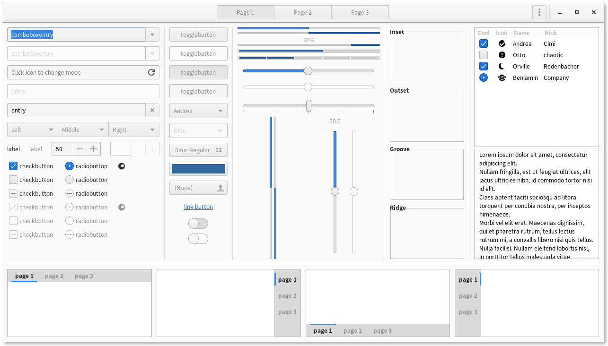
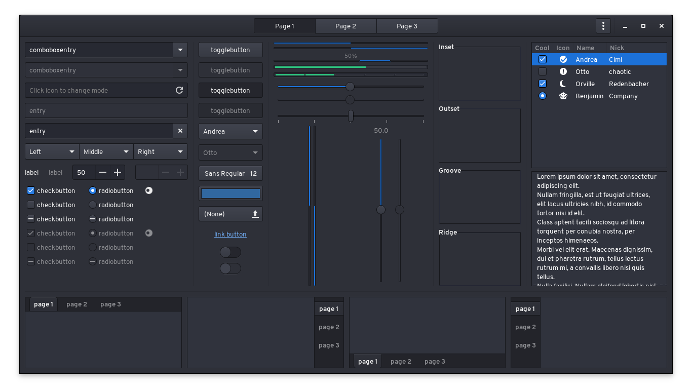

 Tetra
======
Tetra (formerly or codenamed "Project Beaucoup") is Adwaita-based gtk+ theme with design influence from elementary OS stylesheet/theme.

-------------------



# Supported desktop environments
- GNOME 3
- Xfce
- Budgie
- MATE (partial, No WM theme for marco and still not completed.)

### Not supported desktops
- Cinnamon
> Not happening. See you in 2019.
- Pantheon
> Elementary OS is NOT compatible.
- LXDE
- Window Managers (Openbox, enlightenment...)
> Openbox support is considered for future alongside LXDE/PIXEL desktop support.
- Qt/Non-gtk+ desktops (Plasma 5, LXQt...)


### Ubuntu 18.10
> Ubuntu 18.10 ships with GNOME 3.30 desktop, but Nautilus file manager is still version 3.26 because that goddamn desktop icons feature, Ubuntu 18.04 (and 16.04*) support will remain, but not for 18.10 since it will broke Nautilus pathbar styling (unless if Ubuntu Desktop/UG team/someone backport Nautilus 3.30 to 18.10 via PPA)
**Update: See ubuntu-1810 branch for special version for Ubuntu 18.10**
**Update2: Deprecated. Ubuntu 18.10 is NOT REALLY, really supported.**

# (GNOME Shell) Typography
[**Source Sans Pro**](https://github.com/adobe-fonts/source-sans-pro) is used as default primary font for GNOME shell theme, In some Linux distributions, Source Sans Pro is available in their repository, Noto Sans is used as fallback.

# Installation
### Dependencies
before you installing this theme, you need this package installed on your system:
- `sassc` for compiling sass css sources
- `gtk` 3.22
- [Ubuntu 16.04 users read this](https://github.com/hrdwrrsk/tetra-gtk-theme/wiki/Ubuntu-16.04-users-read-this)
- `bc` (required before running `install.sh` script)

#### Required for rendering assets
- `inkscape`
- `optipng`

Then run this command:

```
git clone https://github.com/hrdwrrsk/tetra-gtk-theme.git
cd tetra-gtk-theme

# System-wide install
sudo ./install.sh

# Local install
./install.sh -d ~/.themes
```

# Reporting bugs
report it via "Issues" tab, Pull request for bugfixes also accepted.
for suggestion about design add [design] tag, for DEs/gtk+ app theming/etc. support, add [feature request] tag

# Credits
- Adwaita gtk+ theme
- elementary OS stylesheet/gtk+ theme as main inspiration (also color palette.)
- install.sh, parse-sass.sh and render-assets.sh script are from nana-4's materia-theme
- some other projects: Adapta, Arc, plane-gtk-theme, etc.
